# AutoScaling

트래픽이 늘어나면 자동으로 EC2인스턴스를 생성해 서비스를 확장하는 기능

클라우드 서비스이기에 가능한 AWS의 대표적인 기능

보통 AutoScaling은 ELB와 함께사용
 생성한 인스턴스를 ELB에 연결하고 로드밸런싱 실시

Cloud Watch와 연동하여 CPU, 네트워크 사용이 늘어나거나 줄어들었으때 확장, 삭제 대응
 cloud watch 의 모든 측정치와 연동 가능

EC2 생성은 AMI를 이용 
 AMI 생성시 유저 데이터의 스크립트를 이용하여 깃에서 어플리케이션 기동

