## 가용 영역 `AWS Availability Zones`　
- 데이터 센터
- 같은 지역 도시라해도 멀리 떨어져있음
- 하나의 가용영역이 작동불능이 되더라도 다른 가용영역에서 서비스 재개

### Each region has many availability zones
 (usually 3, min is 2, max is 6). Example:

- Each availability zone (AZ) is one or more discrete data centers with redundant power, networking, and connectivity
- They’re separate from each other, so that they’re isolated from disasters
- They’re connected with high bandwidth, ultra-low latency networking

### 각 리전은 여러개의 가용영역을 보유
- 각 가용 영역(AZ)은 중복 전원, 네트워킹 및 연결 기능을 갖춘 하나 이상의 개별 데이터 센터입니다.
- 서로 분리되어 있어 재난으로부터 격리됩니다.
- 고대역폭, 초저지연 네트워킹으로 연결됩니다.
