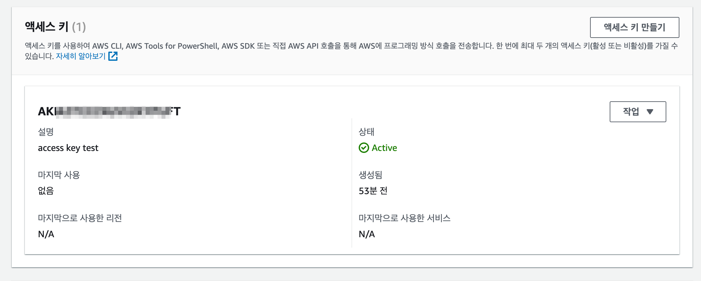

# Access Key

엑세스 키 `Access Key`와 시크릿 키 `Secret Key`는 AWS API와 3rd party tool을 사용할 때 필요한 인증 수단

- API와 3rd party tool을 사용할 때 생성
- AWS의 모든 리소스는 API로 제어가 가능
- 엑세스 키와 시크릿 키 유출되지 않도록 주의
- AWS 에서는 IAM`Identity and Access Management`에서 계정을 생성한 뒤 권한을 제한할 것을 권장

