# CloudFront

CloudFront는 전 세계에 파일을 빠른 속도로 배포하는 CDN 서비스

CloudFront를 사용해야 하는 이유 : 전송 속도 향상과 비용 절감

- 전 세계 주요지역에 위치하고 있기때문에 각 사용자들은 가장 가까운 에지 로케이션에서 파일을 빠르게 다운로드
- 사용자가 맨 처음 CloudFront 에지 로케이션에 접속했을때, 원하는 파일이 있으면 에지 로케이션에서 바로 다운로드
- 파일이 없으면 오리진에 접속
- 에지 로케이션에 캐시파일 유지 시간 : 기본 24시간, HTTP 헤더 Cache-Control로 조절 가능
-  무효화 `Invalidation`요청을 통해 캐시된 파일 삭제 가능

## Cloud Front와 일반적인 CDN의 차이점
- 동적 컨텐츠 전송 `Dynamic Content Delivery` 지원
    - URL 규칙에 따라 정적페이지는 캐시, 동적 페이지는 EC2로 접속 구성도 가능
    - HTTP GET이외에도 여러 메서드 지원
    - POST,PUT,DELETE,OPTIONS,PATCH 메서드는 곧바로 오리진으로 전달
    - HTTP 쿠키를 지원
- 동영상 전송을 위한 라이브 스트리밍 프로토콜을 지원
- 선납금이나 최소약정 사용량이 없고, 사용한 만큼만 지불

## CloudFront 배포

CloudFront 배포 `Distribution`은 CloudFront의 가장 기본적인 단위

독립적인 도메인을 보유 -> Route53/ 별도의 DNS 서버에서 CNAME으로 설정 가능

CloudFront가 지원하는 오리진
- S3 버킷
- EC2 인스턴스
- ELB
- AWS 이외의 웹서버

> 모든 에지 로케이션에 배포 소요시간 : 15 ~ 20 분

## Signed URL 
Signed URL은 Cloud Front로 배포되는 파일의 사용을 제한하는 기능

특정 날짜가 지나면 파일을 받지 못하게 하고 싶을때, 특정 날짜 이후에 파일을 받게 하고 싶을때, 특정 IP에서만 파일을 받을 수 있도록 할 때 사용

- Canned Policy를 이용한 Signed URL : 파일 1개의 사용을 제한, 특정 날짜가 지나면 파일을 받지 못하게 하는 기능만 사용, policy가 URL에 포함되지 않아 URL이 짧다
- Customed Plicy를 이용한 Signed URL :  파일 여러 개의 사용을 제한, 특정 날짜가 지나면 파일을 받지 못하게 하는 기능, 특정 날짜 이후에 파일을 받게 하는 기능, 특정 IP에서만 파일을 받을 수 있도록 하는 기능, policy가 URL에 포함되어 URL의 길이가 길다

## Signed URL 사용 설정하기
Signed URL을 사용하려면 CloudFront의 배포에서 Behavior 설정이 필요
