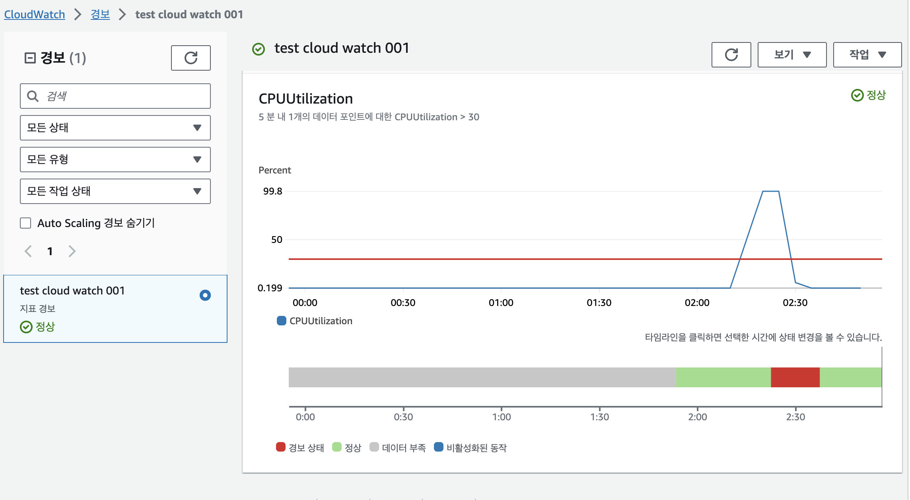
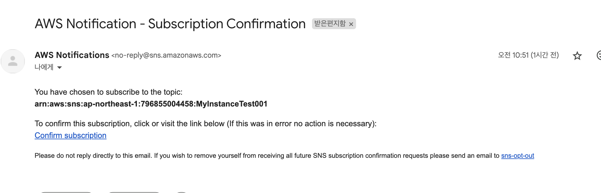

# Cloud Watch
AWS 리소스의 상태를 모니터링 및 측정치`metric`와 연계한 다양한 액션 사용 가능한 서비스

- EC2 인스턴스가 이상이 있을 경우 알람을 받고자 할때
- 사용량 급증시 Auto Scaling -> ELB 구축 등
- AWS에서 제공하는 측정 목록이외의 커스텀 측정치 `Custom Metric`도 이용 가능
- 기본 모니터링 간격 : 5분 (무료)
- 세부 모니터링 간격 : 1분 (추가 요금)



## 각 리소스에 따른 측정치 및 액션
| AWS Resource |Metric | Actions|
| --- | --- | --- |
|EC2 instance | CPU 사용률, 데이터 전송량, 디스크 사용랑| Notification, Auto Scailing, EC2 instance 제어 액션|
|EBS Volume | 읽기/쓰기 사용량, 지연 시간| Notification, Auto Scailing|
|ELB `Elastic Load Balancing` | 요청 수 및 지연 시간| Notification, Auto Scailing|
|RDS `Relational Database Service` | CPU 사용률, DB연결 수, 사용 가능 메모리 및 스토리지 공간, 읽기/쓰기 지연시간| Notification, Auto Scailing|
|DynamoDB | 테이블 인덱스, 글로벌/로컬 보조 인덱스에서 소모한 읽기/쓰기 용량 유닛, 스캔,쿼리, 아이템 추가 및 수정, 삭제| Notification, Auto Scailing|
|ElasticCache | CPU 사용률, 데이터 읽기/쓰기, 네트워크 사용량, 캐시 엔진의 갹 명령어 사용랑| Notification, Auto Scailing|
|SNS `Simple Notification Service` | 게시 및 전송 메세지 수| Notification, Auto Scailing|
|SQS `Simple Queue Service` | 전송 및 수신된 메세지 수| Notification, Auto Scailing|

### Cloud Watch 생성 후 메일 알람 받기





## Custom 측정치

Cloud Watch에서는 기본적으로 제공하는 측정치 이외에 사용자가 측정한 값을 사용할 수도 있어 이를 커스텀 측정치 `Custom Metric`이라 한다.

서버 어플리케이션, 로그 파일, 언어 레벨에서 측정치를 생성하고 이값들을 모니터링하거나 Cloud Watch 액션을 제어하고 싶을 때 사용

### AWS CLI 설정
```
aws configure
```

### 커스텀 측정치 생성
```
aws cloudwatch put-metric-data --namespace "Hello" --metric-name "World" --value 10
```

- Linux cron에 등록하여 사용
- Node.js 의 child_process.exec를 사용
- AWS Javascript SDK 활용


