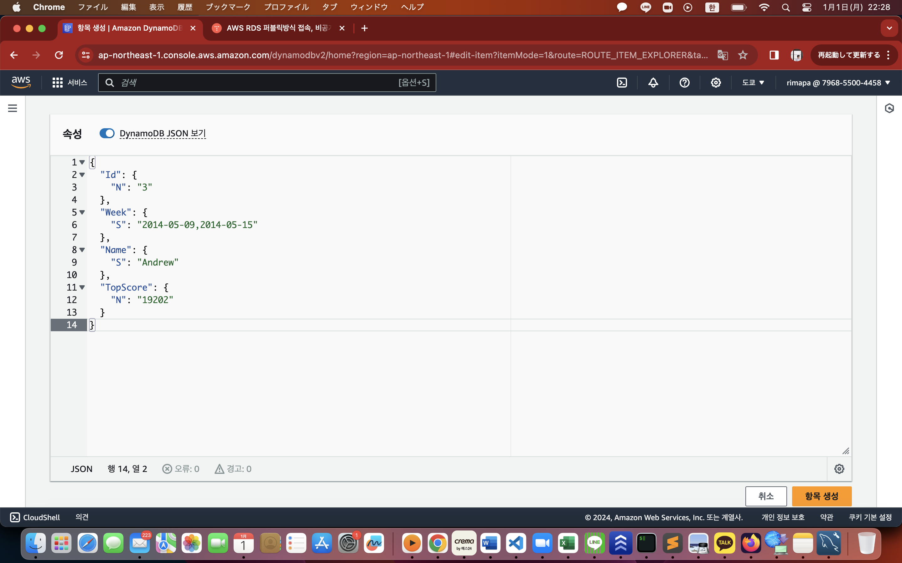

# Dynamo DB

NoSQL 데이터 베이스를 제공하는 서비스

성능, 편의성, 대규모 DB 구축에 필요한 비용 절감

- 읽기 쓰기가 빈번하고 처리 속도가 빨라야 하는 환경
- 작은 용량의 데이터가 매우 많을때
- 고가용성의 분산데이터베이스 운용 비용이 부담될 때
- 모바일 게임, 소셜 네트워크 등의 서비스에 적합
- 트랜잭션, 조인과 같은 복잡한 쿼리가 필요한 환경에는 부적합

Dynamo DB는 리전 별로 생성할 수 있으며, 성능과 가용성을 위해 데이터를 3곳의 AZ에 복제 -> 장애대응, 가용성과 지속성, 백업 불필요

저장 용량 무제한

데이터 용량이 증가하면 자동으로 스토리지를 늘리고 클러스터를 확장하여 데이터를 분산

DynamoDB와 샤딩을 지원하기 때문에 애플리케이션에서 샤딩 구현 불필요

읽기/쓰기 처리량 직접 지정 가능 [요금표](https://aws.amazon.com/ko/dynamodb/pricing/)

## DynamoDB 기본 구조

- 테이블 : 아이템들의 모음, 아이템 갯수 무제한, 기본 키 필수 지정, 리전당 최대 256개 테이블 생성
- 아이템 : 아이템은 속성들의 모음, 속성 갯수 무제한, 속성 이름과 값을 포함하여 64kb, 기본 키 필수 포함, 복합키 기타 속성
- 속성 : 키 - 값 키는 반드시 문자열

    속성이 지원하는 값 형식 
    - 스칼라 데이터 형식 (숫자, 문자열, 바이너리)
    - 다중 값 형식 (배열)

Dynamo 기본키 : 해시 형식과 해시와 범위 형식

해시 기본키(파티션 키)는 일치 방식 검색만 지원

범위키(정렬키)는 일치, 부등호, 포함, ~로 시작 등의 검색을 지원

기본키로 생성한 인덱스 하나만으로 검색 기능이 부족하기 때문에 보조 인덱스 지원
- 로컬 보조 인덱스 : 해시키는 테이블 인덱스의 해시키와 같고, 범위키는 다르게 설정, 테이블당 최대 5개, 테이블 생성시 함께 생성, 생성후 후 변경 불가
- 글로벌 보조 인덱스 : 해시키와 범위키를 다르게 설정, 테이블당 최대 5개, 테이블 생성시 함께 생성, 생성후 후 변경 불가
    
데이터를 읽을 때, Eventually Consistent Read 와 Strongly Consistent Read 사용 가능

- Eventually Consistent Read (기본) : 읽은 데이터가 최근 완료된 쓰기 결과를 반영하지 못할 수 도 있다. 읽기 반복 필요

- Strongly Consistent Read : 최근 완료된 쓰기 결과가 모두 반영된 데이터를 가져옴

Eventually Consistent Read가 읽기 속도가 빠르다

DynamoDB의 데이터 조회 방법
- Scan : 전체 데이터 검색
- Query : 해시에 값, 범위에 조건을 지정하여 데이터 검색

> Json으로 항목 생성

> Query
