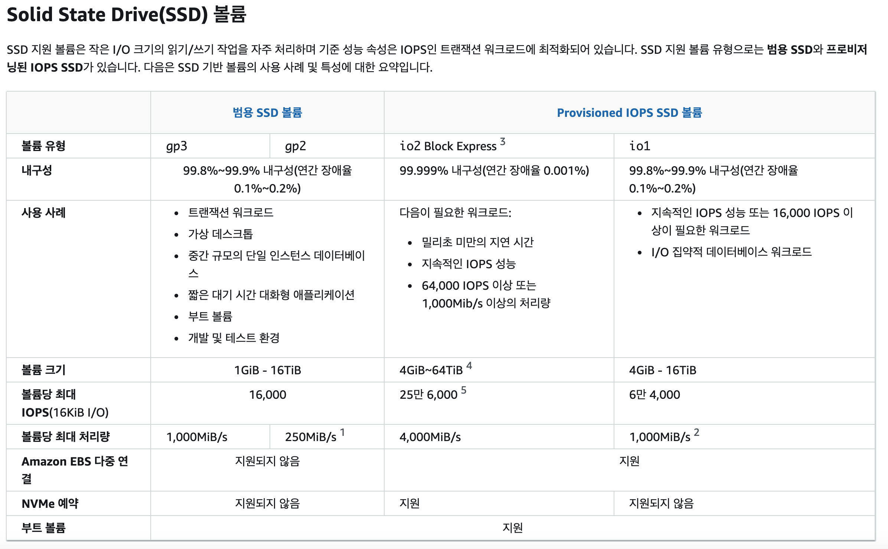

# EBS Volume Type

EBS 볼륨 6가지 종류
- gp2 / gp3(SSD): 다양한 워크로드에 대해 가격과 성능의 균형을 맞춘 범용 SSD 볼륨
- io1/io2(SSD): 미션 크리티컬한 짧은 지연 시간 또는 높은 처리량 워크로드를 위한 최고 성능의 SSD 볼륨
- st1(HDD): 자주 액세스하고 처리량 집약적인 워크로드를 위해 설계된 저렴한 HDD 볼륨
- sc1(HDD): 자주 액세스하지 않는 워크로드를 위해 설계된 최저 비용의 HDD 볼륨
- EBS 볼륨은 크기 | 처리량 | IOPS(초당 I/O Ops) 
- gp2/gp3 및 io1/io2만 부팅 볼륨으로 사용 가능

## General Purpose SSD

- 비용 효율적인 스토리지, 짧은 지연 시간
- 시스템 부팅 볼륨, 가상 데스크탑, 개발 및 테스트 환경 
- 1GiB - 16TiB
- GP3:
  - 기본 3,000 IOPS 및 처리량 125MiB/s
  - 독립적으로 IOPS를 최대 16,000까지, 처리량을 최대 1,000MiB/s까지 늘릴 수
- GP2:
  - 작은 gp2 볼륨은 IOPS를 3,000까지 버스트할 수 있
  - 볼륨 크기와 IOPS가 연결되어 있으며 최대 IOPS는 16,000
  - GB당 3 IOPS는 5,334GB가 최대 IOPS

  USE case

- 트랜잭션 워크로드
- 가상 데스크톱
- 중간 규모의 단일 인스턴스 데이터베이스
- 짧은 대기 시간 대화형 애플리케이션
- 부트 볼륨
- 개발 및 테스트 환경

## 프로비저닝된 IOPS(PIOPS) SSD
- 지속적인 IOPS 성능을 갖춘 중요한 비즈니스 애플리케이션
- 또는 16,000 IOPS 이상이 필요한 애플리케이션
- 데이터베이스 워크로드에 적합(스토리지 성능 및 일관성에 민감)
- io1/io2(4GiB~16TiB):
  - 최대 PIOPS: Nitro EC2 인스턴스의 경우 64,000, 기타 인스턴스의 경우 32,000
  - 스토리지 크기에 관계없이 PIOPS를 늘릴 수 
  - io2는 더 높은 내구성과 GiB당 더 높은 IOPS를 제공(io1과 동일한 가격).
- io2 블록 익스프레스(4GiB – 64TiB):
  - 밀리초 미만의 지연 시간
  - 최대 PIOPS: 256,000(IOPS:GiB 비율 1,000:1)
- EBS 다중 연결 지원

---

> [ebs-volume-types](https://docs.aws.amazon.com/ko_kr/AWSEC2/latest/UserGuide/ebs-volume-types.html)

## EBS Multi-Attach – io1/io2 family

동일한 AZ의 여러 EC2 인스턴스에 동일한 EBS 볼륨 연결
- 각 인스턴스에는 고성능 볼륨에 대한 전체 읽기 및 쓰기 권한
- 사용 사례:
  - 클러스터링 환경에서 더 높은 애플리케이션 가용성 달성
  - Linux 애플리케이션(예: Teradata)
- 애플리케이션은 동시 쓰기 작업을 관리해야
- EBS Multi-Attach : 한 번에 **최대 16개의 EC2 인스턴스** 
- 클러스터를 인식하는 파일 시스템을 사용(클러스터 인식이 아님,XFS, EXT4 등...)