# ELB

ELB `Elastic Load Balancing`는 부하분산과 고가용성을 제공하는 서비스

비용절감, 효율성

한곳에만 집중되는 HTTP,TCP,SSL 트래픽을 여러 인스턴스로 분산

Health check를 통해 정상 가동중인 서버에만 전송

리전별로 생성, 여러 가용영역에서 실행되는 EC2 인스턴스로 분산가능

외부 트래픽 뿐아니라 내부 트래픽에서도 사용 가능

## ELB의 기본 개념

- L4 : OSI레이어의 4번째 전송계층 
    - TCP, UDP대표적 
    - 포트번호로 구분
    - OSI 3레이어인 네트워크 계층의 IP와 묶어서 처리
    - L4 로드밸런싱 IP 주소와 포트 번호로 트래픽을 분산

- L7 : OSI레이어의 7번째 애플리케이션계층 
    - HTTP 대표적
    - L7 로드밸런싱 HTTP 헤더의 내용을 기준으로 트래픽을 분배

- 로드밸런싱 알고리즘 : 라운드로빈 `Round Robin` 우선순위 없이 순서대로 분배

- 헬스체크 : EC2 인스턴스가 정상적으로 가동중인지 확인, 중단되었다고 판단된 인스턴스에는 트래픽 분배 X

- Connection Draining : Auto Scaling이 사용자의 요청을 처리 중인 인스턴스를 바로 삭제하지 못하도록 방지하는 기능

    - EC2 인스턴스를 삭제하기 전에 사용자의 요청을 처리할 수 있도록 지정된 시간 만큼 대기
    - 대기 중 새로운 커넥션은 받지 X

- ELB HTTP 2XX, 4XX, 5XX : ELB에서 리턴한 HTTP 코드

- Surge Queue Length : ELB 에서 EC2로 전달되지 못하고 남아있는 요청의 갯수

- Spillover count : 서지 큐가 꽉차서 ELB가 거부한 요청의 갯수 

## Types of load balancer on AWS
4가지 종류의 관리형 로드 밸런서
- Classic Load Balancer (v1 - old generation) – 2009 – CLB 
  - HTTP, HTTPS,TCP,SSL(secureTCP)
- Application Load Balancer (v2 - new generation) – 2016 – ALB 
  - HTTP, HTTPS,WebSocket
- Network Load Balancer (v2 - new generation) – 2017 – NLB 
  - TCP,TLS(secureTCP),UDP
- Gateway Load Balancer – 2020 – GWLB
  - Operates at layer 3 (Network layer) – IP Protocol