# Gateway Load Balancer

게이트웨이 로드 밸런서
- AWS에서 타사 네트워크 가상 어플라이언스를 배포, 확장 및 관리
- 예: 방화벽, 침입 탐지 및 예방 시스템, 심층 패킷 검사 시스템, 페이로드 조작 등
- 레이어 3(네트워크 레이어)에서 작동 – IP 패킷
- 다음 기능을 결합
- 투명한 네트워크 게이트웨이 – 단일
- 로드 밸런서 – 가상 어플라이언스에 트래픽을 분산
- 포트 6081에서 GENEVE 프로토콜을 사용

