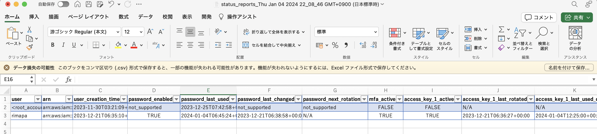
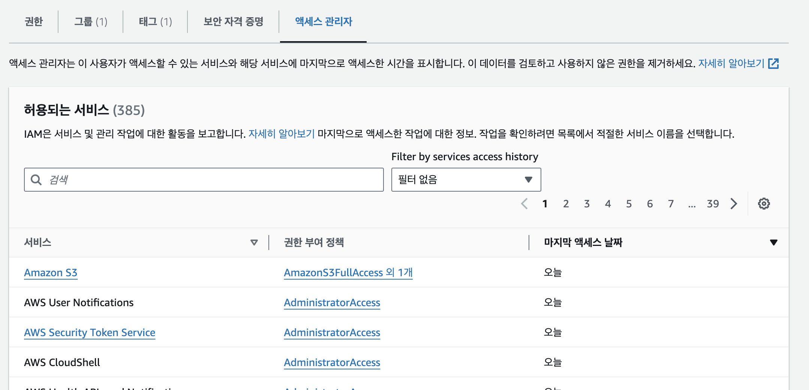

# IAM `Identity and Access Management`
사용자와 그룹을 생성하고 AWS의 각 리소스에 대해 접근 제어와 권한 관리를 제공

> 사용 요금 X

AWS의 유저를 관리하는 Global service

- 기본적으로 생성된 루트 계정은 사용하거나 공유 X
- 사용자는 조직 내의 사람들이며 그룹화 가능
- 그룹에는 사용자만 포함되며 다른 그룹은 포함 X
- 사용자는 반드시 그룹에 속할 필요는 없으며, 여러 그룹에 할당 가능

    > 그룹에 속하지 않은 사용자는 인라인 폴리시 적용 가능

IAM은 AWS 계정안의 IAM 그룹과 사용자를 생성하여 접근 제어 및 권한 관리 세분화 가능

전체 권한이 아닌 필요한 권한만 부여 -> 보안성 높다

IAM그룹은 동일한 권한을 여러 IAM사용자에게 적용 시킬 때 사용

AWS콘솔에서도 허용된 리소스만 접근 가능

엑세스 키 별도 생성 가능

## IAM Group
IAM 사용자를 모아놓은 것

그룹에 접근제어 및 권한 설정 그룹안의 사용자에게 적용

<font size = 4, color = red>IAM 사용자 그룹은 다른 사용자 그룹에 속할 수 X </font>

## IAM Role
EC2 인스턴스 / 다른 AWS 계정 전용으로 권한 설정 가능

EC2 인스턴스 전용 IAM Role은 EC2 인스턴스 생성시 적용 필요

일부 AWS 서비스는 사용자를 대신하여 작업을 수행 필요<br>
이를 위해 IAM Role을 사용하여 AWS 서비스에 권한을 할당
- EC2 인스턴스 Role
- Lambda 함수 Role
- CloudFormation의 Role

## Identity Provider
SAML Provider를 생성

> [자격 공급자](https://docs.aws.amazon.com/ko_kr/IAM/latest/UserGuide/id_roles_providers.html)
## IAM Policy 생성

Visual Editor 이용이 편리하다

- Users or Groups can be assigned JSON documents called policies
- These policies define the permissions of the users
- In AWS you apply the least privilege principle: don’t give more permissions than a user needs

- 사용자 또는 그룹에 정책이라는 JSON 문서를 할당 가능
- 이러한 정책은 사용자의 권한을 정의
- AWS에서는 최소 권한 원칙을 적용 즉, 사용자에게 필요한 것보다 더 많은 권한을 부여 X

<font size = 4, color = red>IAM 정책의 문장은 시드, 효과, 원칙, 조치, 리소스, 그리고 조건으로 구성</font> <br> 버전은 IAM 정책 자체의 일부이지, 문장의 일부가 X

```
{
    "Version": "2012-10-17", 
    "Statement": [
        {
            "Effect": "Allow", "Action": "ec2:Describe*", "Resource": "*"
        }, 
        {
            "Effect": "Allow",
            "Action": "elasticloadbalancing:Describe*", "Resource": "*"
        }, 
        {
            "Effect": "Allow",
            "Action": [
            "cloudwatch:ListMetrics", "cloudwatch:GetMetricStatistics", "cloudwatch:Describe*"
            ],
            "Resource": "*"
        }
    ]
}
```


### Policy 구성
- Version: 정책 언어 버전, 항상 “2012-10- 17” 포함
- Id:정책에 대한 식별자(선택)
- Statement: 하나 이상의 개별 명세서(필수)

### Statement 구성
- Sid:문에 대한 식별자(선택)
- Effect: 문이 액세스를 허용하거나 거부하는지 여부(허용, 거부)
- Principal`주체`: 본 정책이 적용되는 계정/사용자/역할
- Action: 이 정책이 허용하는 작업 목록은 거부를 허용
- Resource: 작업이 적용된 리소스 목록
- Condition`조건`: 이 정책이 적용되는 조건(선택 사항)


## IAM 보안 도구
- IAM 자격 증명 보고서(계정 수준) `IAM Credentials Report (account-level)`
    - 계정의 모든 사용자와 다양한 사용자 상태를 나열하는 보고서
    - 사용자가 비밀번호를 바꾸고 있는지 등 보안 관련 정보 확인에 유용
    
신임장
- IAM 액세스 관리자(사용자 수준) `IAM Access Advisor (user-level)`
    - 액세스 조언자는 사용자에게 부여된 서비스 권한과 해당 권한이 부여된 시기를 표시
    - 해댱 유저가 서비스에 마지막으로 액세스한 정보를 표시 -> 최소권한원칙에 의거하여 사용하지 않는 서비스에 대한 권한 제거하여 보안성 향상
    