# Key Pair
EC2 인스턴스에 접속하기 위해 사용하는 암호화된 파일

- AWS에서는 보안문제 때문에 ID, PW 접속 방식 비권장
- Key Pair 접속방식은 분실하지 않으면 매우 안전
- Key Pair는 RSA 공개키 알고리즘을 사용

## RSA 알고리즘
- 대칭키 방식은 키가 전달되는 구간에서 노출 가능성이 있음
- 공개키는 암호화 키와 복호화 키를 다르게 설정하기 때문에 암호화 키가 외부에 노출 되어도 안전
    - Public Key : 암호화 키, 공개키
    - Pricate Key : 복호화 키, 개인키 (비밀키)



## AWS에서의 Key Pair
- Public Key, Private Key Pair
- Region별로 관리
- 보안성이 높다
- 자동화에 유리
- 인스턴스 생성시 Key Pair 함께 생성


## SSH 접속방법

``` sh
ssh -i {.pem_path/fileName} ec2-user@{public IP address}

```

- .pem fileName : No Space

- 권한 에러가 발생할 경우 권한 지정

``` sh
chmod 0400 {.pem_path/fileName}

```