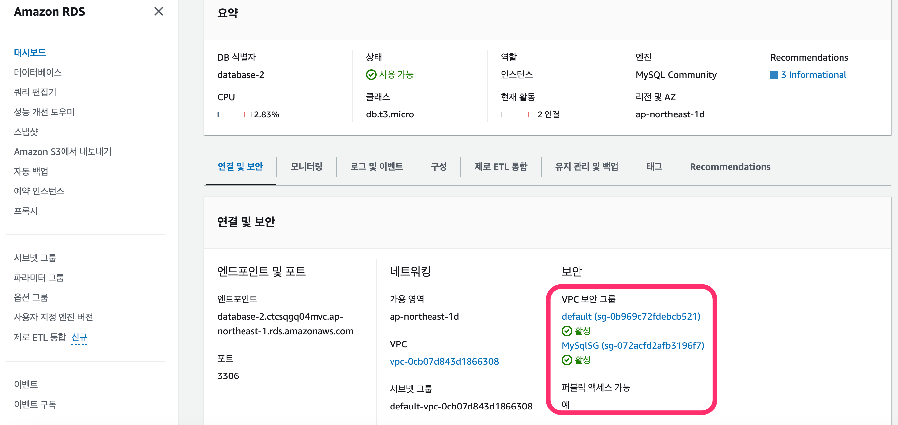

# RDS
RDS `Relationship Database Service` 관계형 데이터베이스를 손쉽게 생성하고 확장할 수 있는 서비스

RDS를 사용해야 하는 이유 : 성능, 편의성, 시간 절약

몇번의 클릭으로 손쉽게 DB 인스턴스를 생성 가능

사용량이 늘어나면 스토리지 용량과 IOPS를 증가시켜 성능 확장이 가능

장애가 발생해도 Failover 기능을 통해 정상적인 서비스 제공 가능

Read Replica를 이용한 읽기 성능 향상

## RDS 인스턴스 클래스

비용 절감과 효율성을 위해 RDS의 DB인스턴스도 EC2와 같이 사양에 따라 여러 클래스로 분류

사용량이 적으면 낮은 사양의 클래스, 사용량이 많으면 높은 사양의 클래스를 선택 가능

| DB 인스턴스 클래스 | 설명 | 종류 |
| -- | -- | -- |
| 마이크로 인스턴스 | 가장 싼 인스턴스, 낮은 vCPU와 적은 메모리, 프리티어 사용가능 | db.t1.micro, db.t2.micro |
| 스탠다드 | 평균적인 vCPU와 메모리 | db.m1.small, db.m3.miedium |
| 메모리 최적화 | 메모리 용량이 훨씬 큼| db.m2.xlarge|

RDB인스턴스의 구매 옵션 : 온디맨드 

> [RDB 요금표](https://aws.amazon.com/ko/rds/pricing/)

## RDS 예약 인스턴스

- Ligth 사용률 인스턴스 : 선결제 금액이 저렴, 단기 프로젝트에 적합
- Medium 사용률 인스턴스 : 선결제 요금이 Light  보다 비싸지만 시간당 요금이 저렴, 거의 항상 실행하지만 사용량에 약간의 변화가 있을 경우
- Heavy 사용률 인스턴스 : 선결제 요금이 Heavy보다 비싸지만 시간당 요금이 가장 저렴, 24시간 상시 가동제품

## 멀티 AZ 복제 와 Failover

Multi-AZ복제 설정 후 메인 DB에 장애 발생 시, Failover가 동작하여 예비 인스턴스가 메인 인스턴스로 승격, 3 ~ 6 분 소요, 엔드포인트가 가르키는 디비가 자동으로 변경, MySQL과 Oracle만 지원

## RDS DB 인스턴스 Security Group 생성

퍼블릭 엑세스 허용 설정 필요

외부에서 엔드포인트 주소로 접속하려면 RDS DB 인스턴스 전용 Security Group을 생성하여 MySQL포트(3306) 개방 필요

## RDS 스냅샷

RDS DB 스냅샷은 DB의 전체 내용 중 특정시점을 파일로 저장

- DB 자동 백업 : RDS 인스턴스를 삭제하면 함께 삭제
- DB 스냅샷 : DB 인스턴스 삭제하더라도 유지, 다른 리전으로 복사 가능

## Read Replica 생성

DB 인스턴스의 읽기 복제본을 만들어 성능 향상

쓰기 작업은 마스터 DB 인스턴스가 담당, 읽기 작업은 슬레이브 DB에서 실시 -> 부하 감소

## RDS DB 인스턴스 성능 확장하기

사양을 높여 성능을 확장하는 수직확장 `Vertical Scaling` / `Scale Up`

- DB 인스턴스 클래스 : 상위 단계 클래스로 변경하여 vCPU와 메모리 용량 증가
- 스토리지 용량
- Provisioned IOPS : 스토리지 용량이 100G가 이상일 떄 사용가능