# Aurora

높은 가용성과 읽기 스케일링

- 6개의 복제본이 4개의 AZ에 걸쳐서 존재
- 하나의 마스터 쓰기 인스턴스
- 마스터의 failover는 30초 이내 완료
- 최대 15개까지 읽기 레플리카 가동 가능
- 크로스 리전 레플리카 지원

## Aurora 클러스터

쓰기 엔트포인트와 읽기 엔드포인트가 따로 존재하기 때문에 읽기 작업은 읽기 엔드포인트 지정으로 레플리카에 로드밸런싱 가능

### 레플리카 오토스케일링
읽기 작업이 많이 발생하여 CPU사용량이 증가해 오토 스케일링에 의해 복제본이 생성되더라도 읽기 전용 엔드포인트는 새로 생성된 복제본까지 로드밸런싱 할 수 있게 자동 확장  

### 커스텀 엔드포인트
다양한 워크로드를 수용할 수 있게 리드 레플리카의 하위집합을 분류하여 엔드포인트를 따로 설정하는 것이 가능

### 오로라 서버리스
워크로드가 적은 경우, 초당 사용량만큼만 비용 지불

### 멀티 마스터
쓰기 가용성을 높이고 싶은 경우 사용

### 글로벌 오로라
리전간 읽기 복제본이 있는경우

- Aurora 교차 지역 읽기 전용 복제본: 
    - 재해 복구에 유용
    - 설치가 간편함
- Aurora 글로벌 데이터베이스(권장):
    - 기본 지역 1개(읽기/쓰기)
    - 최대 5개의 보조(읽기 전용) 지역, 복제 지연이 1초 미만
    - 보조 지역당 읽기 복제본 최대 16개
    - 지연 시간 감소에 도움
    - 재해 복구를 위해 다른 지역을 승격하면 RTO가 1분 미만
    - 일반적인 **리전 간 복제에는 1초 미만**이 소요

### 오로라 머신러닝
- SQL을 통해 애플리케이션에 ML 기반 예측을 추가할 수 있습니다.
- Aurora와 AWS ML 서비스 간의 간단하고 최적화되었으며 안전한 통합
- 지원 서비스
    - Amazon SageMaker(모든 ML 모델과 함께 사용) 
    - Amazon Comprehend(감정 분석용)
- ML 경험이 필요하지 않습니다.
- 사용 사례: 사기 감지, 광고 타겟팅,감성분석, 상품 추천