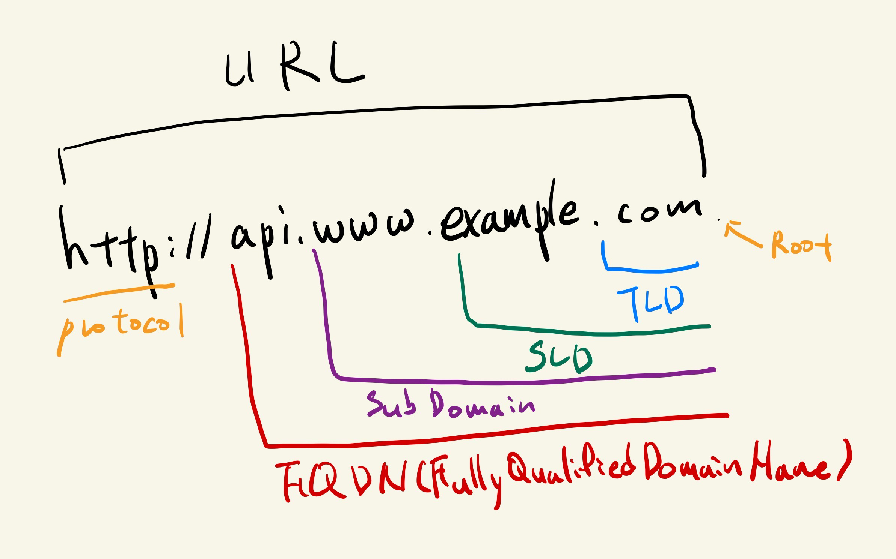

# DNS 개요

사람들에게 익숙한 도메인 네임을 기계적인 IP어드레스로 변환하는 도메인 네임 시스템

- Top Level Domain (TLD) : .com, .us, .in, .gov, .org, ...
- Second Level Domain (SLD): amazon.com, google.com, ...
- Fully Qualified Domain Name (FQDN)
- DNS Records: A, AAAA, CNAME, NS, ...
- Zone File: contains DNS records
- Domain Registrar : Amazon Route 53, GoDaddy, ...