# S3 `Simple Storage Service`

인터넷 스토리지 서비스

용량에 관계없이 파일을 저장하고 웹(HTTP protocol)에서 접근 가능



## S3를 써야하는 이유
- 성능

    저장 용량이 무한대이고 파일 저장에 최적화
    
    용량을 추가하거나 성능을 높이는 추가 작업 X
- 비용

    EC2와 EBS로 파일 시스템 구축보다 훨씬 저렴

- 정적 웹서비스 구축 가능

## S3의 기본 개념

- 객체 `Object` : S3에 데이터가 저장되는 최소 단위, 파일과 메타데이터로 구성
    - Key : 객체의 이름, Value : 객체의 데이터
    - 객체의 크기 1byte ~ 5TB
    - 메타데이터 

        HTTP Content-Type 형식(MIME)

        파일의 확장자에 따라 자동으로 설정, 임의 설정 가능

        키-값의 형식, S3전용 데잍터 및 사용자 정의 메타 데이터도 저장
    
- 버킷 `Bucket`: S3에서 생생할 수 있는 최상위 폴더(디렉터리), 리전별로 생성, 리전별로 유일해야하며 계정별로 100개까지 생성가능
    - 버킷 안에 객채가 저장
    - 하위 폴더 생성 가능, 실제 객체 이름이 디렉터리 경로를 포함
    - 저장 가능한 객채의 수 : 무한대
    - 저장 가능용량 : 무제한
    - 접속 제한 및 권한 관리 가능

- 내구성과 가용성 : 1년을 기준으로 99.99999999% 내구성,99.99% 가용성을 가짐
    - 내구성: 데이터가 유실되지 않는것
    - 가용성: 언제나 정상적으로 사용가능한 강태
- 요금: 저장 용량과 데이터 전송량, HTTP요청 갯수로 책정 
    > [요금 정책](https://aws.amazon.com/ko/s3/pricing/)

## S3의 스토리지 옵션
- 표준 스토리지 `Standard Storage`
    - 일반적인 스토리지 옵션
    - 99.99999999% 내구성
    - 내구성 유지를 위한 요금이 높다
    - 유실되면 안되는 중요한 데이터 저장에 권장
- 낮은 중복 스토리지 `RRS, Reduced Redundancy  Storage`
    - 표준 스토리지 보다 낮은 99.99%의 내구성
    - 데이터를 복제한 사본의 수를 줄여 비용을 낮춤
    - 동영상이나 이미지 썸네일 등, 원본에서 다시 생성할 수 있는 데이터 저장에 적합

## S3에서 권한 관리하기

```
{
    "Version": "2012-10-17",
    "Id": "Policy1703490317071",
    "Statement": [
        {
            "Sid": "Stmt1703487218621",
            "Effect": "Allow",
            "Principal": "*",
            "Action": "s3:GetObject",
            "Resource": "arn:aws:s3:::rimapatestbucket001/*"
        }
    ]
}
```

- Effect : Allow/Deny 선택 가능
- Principal : 권한을 적용할 사용자 (*: 모든 사용자)
- Action : S3의 액션
- Amazon Resource Name `ARN` : 아마존의 리소스를 고유하게 표현하는 방식

    arn:aws:s3:::rimapatestbucket001/* -> S3 버킷 rimapatestbucket001 하위의 모든 파일

