# S3 기타 기능

## S3 정적 웹사이트 호스팅

S3를 웹 서버 형태로 사용 가능

정적 웹사이트 호스팅을 하지 않더라도 S3에 파일을 올리면 브라우저로 파일에 접근 가능 

하지만, 정적 웹사이트 호스팅 설정을 사용하는 것과 큰 차이가 존재

### URL에 차이가 존재
| S3 접근 방식 | URL |
| -- | -- |
| 일반적인 S3 | http://s3-<리전 이름>.amazonaws.com/<버킷 이름>/<파일 이름> |
| 정적 웹사이트 호스팅 | http://<버킷 이름>.s3-website-<리전 이름>.amazonaws.com/<파일 이름> |

> 버킷이름이 서브도메인 형태로 들어가야 DNS 서버에서 CNAME설정 가능

## HTTP Referer로 S3 접근 제한

S3에 올려진 파일을 원하는 도메인에서만 참조할 수 있도록 설정 가능

HTTP Referer는 HTTP 헤더 값으로서 웹브라우저에서 생성하는 데이터

이 헤더를 버킷 정책의 조건에 추가하여 제한 가능

```
{
    "Version": "2012-10-17",
    "Id": "Policy1703490317071",
    "Statement": [
        {
            "Sid": "Stmt1703487218621",
            "Effect": "Allow",
            "Principal": "*",
            "Action": "s3:GetObject",
            "Resource": "arn:aws:s3:::rimapatestbucket001/*",
            "Condition": {
                "StringLike" : {
                    "aws:Referer": "http://rimapatestbucket002.s3-website-ap-northeast-1.amazonaws.com"
                }
            }

        }
    ]
}
```

## S3 객체 스토리지 클래스 암호화

- 스토리지 클래스 : Standard, Reduced Redundancy 
- Server Side Encryption : None과 AES-256을 선택 가능, 중요한 데이터를 좀 더 안전하게 저장하고 싶을 때 사용

## S3 객체 메타데이터 설정하기
S3 객체에 다양한 기능을 하는 메타데이터 설정 가능

메터데이터는 HTTP 1.1 표준에 정의된 메터데이터와 S3 전용 메터데이터로 분류

### HTTP 1.1 표준 메타데이터
| 메터데이터 | 설명 |
| -- | -- |
| Cache-Control | 브라우저의 캐시 정책 설정, value : max-age=3600과 같은 데이터 만기 시간을 초 단위 설정 가능, AWS의 Cloud Front와도 연계 |
| Content-Disposition | Value에 attachment로 설정하면 JPG 파일 같은 경우 웹 브라우저에섯 그림 파일을 보여 주지 않고 바로 다운로드 가능 | 
| Content-Type | 웹 브라우저에서 파일을 어떻게 처리하는지 알려주는 메타데이터, 확장자에 따라 자동 설정, 확장자가 없는 파일은 메타데이터로 형식 지정 가능 |
| Content-Language | 텍스트로 된 파일의 언어를 지정 |
|Expires | 특장 날짜와 시간을 지정하여 만기 설정 |
|Content-Encoding | 데이터 인코딩 방식 |

### S3 전용 메타데이터
| 메터데이터 | 설명 |
| -- | -- |
| Website Rediredt Location | 웹 브라우저로 해당 파일에 접속했을때 다른 파일이나 URL로 리다이렉션 하는 기능 |
| 사용자 정의 메타데이터 | `x-amz-meta` 사용자가 마음대로 사용할 수 있는 메타데이터 |
|  S3 시스템 정의 메타데이터 |  |