# Security Group

EC2에 설정할 수 있는 방화벽

서버 보안의 기본은 방화벽 설정에서 출발


## 관련 용어
- Inbound : 외부에서 내부로 들어오는 트래픽, HTTP, HTTPS, SSH, RDS
- Outbaound : EC2인스턴스에서 외부로 나가는 트래픽, EC2 인스턴스 안에서 인터넷을 사용할 경우, 파일 다운로드, 외부 SSH 접속

- Type : 프로토콜의 형태 (TCP, UDP, ICMP)

- Port, Prot Range : 포트번호
    - UDP, TCP : 0 ~ 65535
    - ICMP : 포트번호 사용 X

- Source/Destination : 연결 혹은 접속 가능한 IP 대역
    - Inbound 의 경우 Source
    - Outbound 의 경우 Destination
    - IP주소 하나만 지정할 수도 있고
    - CIDR 표기법을 이용하여 일정한 대역 설정도 가능

- Rule : 위의 Inbound, Outbound, Type, Port, Source/Destination의 조합

## CIDR 표기법 `Classless Inter-Domain Routing`
IP 주소의 할당 방법

급격히 부족해지는 IPv4 주소를 더욱 효율적으로 사용하기 위해 CIDR 표기법을 사용

```
xxx.xx.xxx.xx/yy

yy 는 Subnet Mask를 2진수로 바꾸었을때 1의 갯수
```


- 192.168.0.0/24 -> 192.168.0.1 ~ 192.168.0.254 
- 192.168.0.15/32 -> 192.168.0.15 하나의 IP