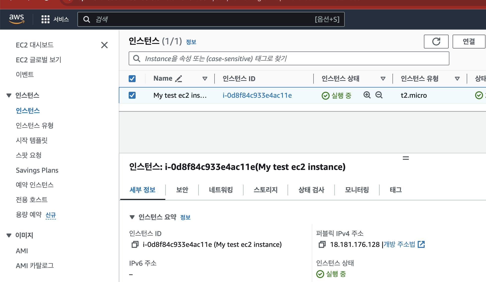

# 가상서버를 제공하는 EC2

## EC2 `Elastic Compute Cloud`

EC2는 가장 인기 있는 AWS 제품 중 하나 
EC2 = 탄력적 컴퓨팅 클라우드 = 서비스로서의 인프라`Infrastructure as a Service` 
주로 다음 기능으로 구성
  - 가상 머신(EC2) 임대
  - 가상 드라이브(EBS)에 데이터 저장
  - 시스템 전체에 부하 분산(ELB)
  - Auto Scaling 그룹(ASG)을 사용하여 서비스 확장

EC2를 아는 것은 클라우드 작동 방식을 이해하는 데 필수

- 인터넷에 연결된 가상서버를 제공
- EC2를 사용하는 이유 : 효율성과 비용절감
    - 효율성 빠르게 구축, 삭제
    - 비용절감 사용한 만큼 비용 부담

## EC2 크기 조정 및 구성 옵션
- 운영 체제(OS): Linux, Windows 또는 Mac OS 
- 컴퓨팅 성능 및 코어(CPU) 용량
- RAM(랜덤 액세스 메모리) 용량
- 저장 공간 크기:
  - 네트워크 연결(EBS 및 EFS) 
  - 하드웨어(EC2 인스턴스 스토어)
- 네트워크 카드: 카드 속도, 공용 IP 주소
- 방화벽 규칙: 보안 그룹 `security group`
- 부트스트랩 스크립트(처음 시작 시 구성): EC2 사용자 데이터 `EC2 User Data`

## EC2 사용자 데이터 `UserData`
- EC2 사용자 데이터 스크립트를 사용하여 인스턴스를 부트스트랩 가능
  - 부트스트래핑은 컴퓨터가 시작될 때 명령을 실행하는 것
- 해당 스크립트는 인스턴스가 처음 시작될 때 한 번만 실행
- EC2 사용자 데이터는 다음과 같은 부팅 작업을 자동화하는 데 사용 
  - 업데이트 설치
  - 소프트웨어 설치
  - 인터넷에서 일반 파일 다운로드
  - 당신이 생각할 수 있는 모든 것
- EC2 사용자 데이터 스크립트는 루트 사용자로 실행 -> `sudo` 필요

## EC2 인스턴스 
EC2에서 생성한 가상서버

 

## 인스턴스 패밀리

| 목적 | 유형 | 설명 |
| -- | -- | -- |
| 범용 |M1, M3 | 평균적 메모리, 네트워크, 저장 공간|
| 컴퓨팅 최적화| C로 시작 | vCPU 비율이 높다 |
| GPU 인스턴스| G로 시작 | 그래픽 최적화 |
| 메모리 최적화 | M2, CR2 | 메모리 용량이 훨씬 크다|
| 스토리지 최적화 | H/I 로 시작 | 스토리지 용량이 훨씬 크거나 초고속 I/O를 제공|
| 마이크로 인스턴스 | T | 낮은 vCPU, 메모리, 프리티어 사용|

## EC2 인스턴스 구매 옵션

 - 온디맨드
    - 필요할때 생성하여 사용
    - 요금은 한시간 단위
    - 공유 인스턴스
    - 전용 인스턴스

- 스팟 인스턴스
    - 경매방식의 인스턴스

- 예약 인스턴스
    - 일정한 금액을 선불하여 예약