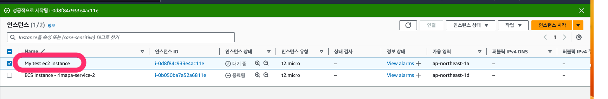
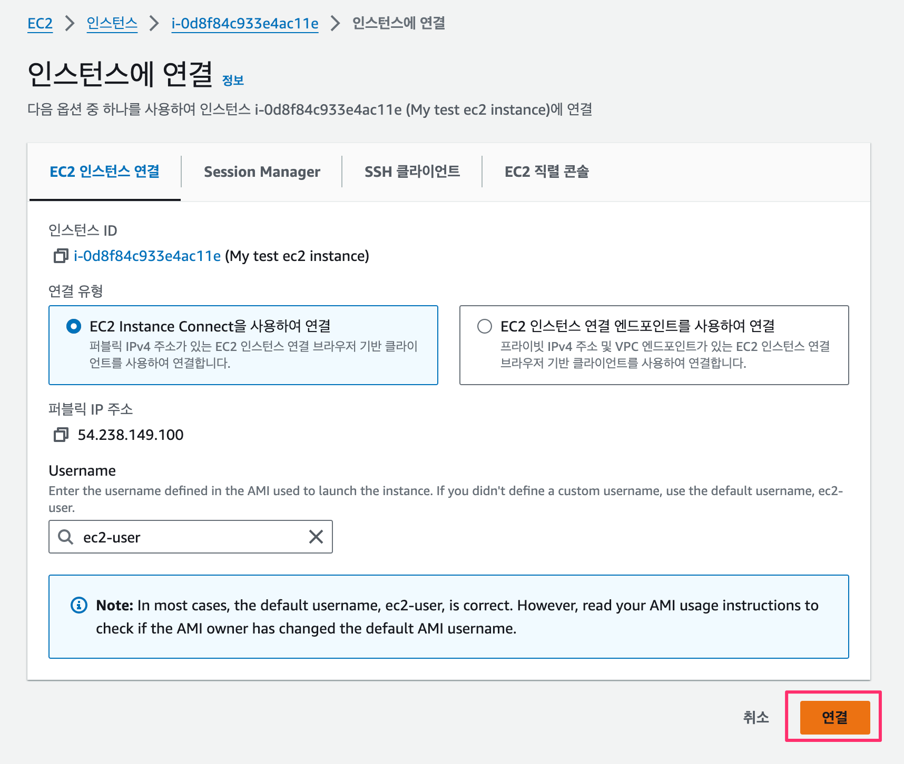

# AWS EC2 에서 도커 설치하기

AWS EC2에서 도커 이미지를 실행하가 위하여 EC2에 도커를 설치해보았다.

> [AWS 공식 문서](https://docs.aws.amazon.com/ko_kr/AmazonECS/latest/developerguide/create-container-image.html) 참조


# 인스턴스 연결

이전에 생성하고 중지해둔 인스턴스를 시작



`인스턴스에 연결`을 이용하여 EC2에 접속


인스턴스에 설치한 패키지 및 패키지 캐시를 업데이트

```
sudo yum update -y
```

최신 Docker Engine 패키지를 설치

인스턴스 OS 버전 확인

```
cat /etc/os-release
```

- For Amazon Linux 2, run the following:
```
sudo amazon-linux-extras install docker
```

- For Amazon Linux 2023, run the following:

```
sudo yum install -y docker
```

Docker 서비스를 시작

```
sudo service docker start
```

(선택 사항) 시스템이 재부팅될 때마다 Docker 대몬이 시작되도록 하려면 다음 명령을 실행

```
sudo systemctl enable docker
```

sudo를 사용하지 않고도 Docker 명령을 실행할 수 있도록 docker 그룹에 ec2-user를 추가
```
sudo usermod -a -G docker ec2-user
```

세션 종료후 재접속

sudo 없이도 Docker 명령을 실행할 수 있는지 확인
```
docker info
```