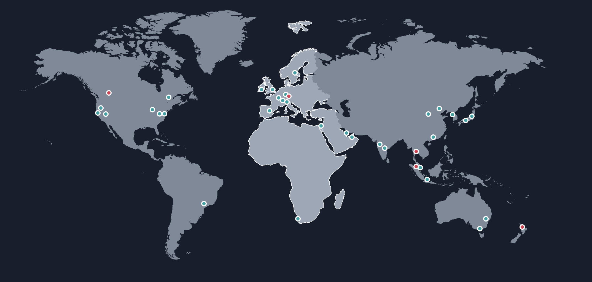

# AWS 지역관련

## region
- AWS의 모든 서비스가 위치하고 있는 물리적인 장소
- 전 세계 주요 지역에 위치
- 하나의 리전안에 여러개의 가용영역
- 가까운 리전에 접속하여 네트워크 속도를 빠르게 한다
- 재해에 대비

## AWS Regions
- AWS has Regions all around the world 
- Names can be us-east-1, eu-west-3... 
- A region is a cluster of data centers
- Most AWS services are region-scoped

## How to choose an AWS Region?
1. Compliance with data governance and legal requirements: data never leaves a region without your explicit permission
1. Proximity to customers: reduced latency
1. Available services within a Region: new services
and new features aren’t available in every Region
?
1. Pricing: pricing varies region to region and is transparent in the service pricing page

## 리전 선정 기준
1. 데이터 거버넌스 및 법적 요구 사항 준수: 명시적인 허가 없이는 데이터가 지역을 떠나지 않게
1. 고객과의 근접성: 대기 시간 감소
1. 지역 내 이용 가능한 서비스 : 신규 서비스
일부 지역만 가능한 새로운 기능
1. 가격: 가격은 지역마다 다르며 서비스 가격 페이지에 투명하게 표시

