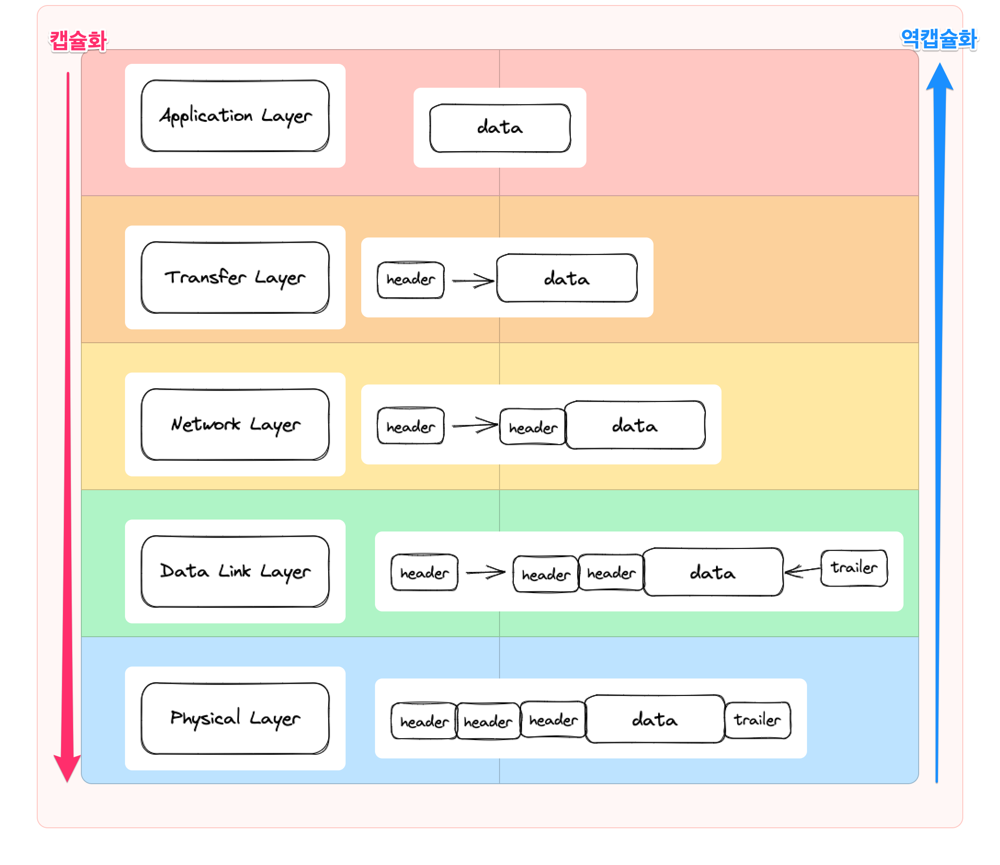

# 모두의 네트워크

## 네트워크의 구조

네트워크란?
> 데이터를 서로 주고 받을 수 있도록 2대 이상의 컴퓨터가 연결되어 있는 것

인터넷?
> 전세계의 큰 네트워크부터 작은 네트워크까지를 연결하는 거대한 네트워크

패킷?
- 웹사이트나 인터넷으로 데이터를 주고 받기 위해서는 규칙이 필요
- 컴퓨터간에 데이터를 주고받을때 네트워크를 통해 전송되는 작은 데이터 조각 : `패킷`
- 데이터가 크더라도 작게 나누는 것이 규칙
- 큰 데이터를 그대로 보내면 그 데이터가 너무 많은 대역폭을 차지하여 다른 데이터의 흐름을 방해할 위험이 존재
- 패킷에 번호를 붙여 도착하면 순서대로 나열

## 정보의 양을 나타내는 단위

디지털 데이터?
> 모든 컴퓨터는 0과 1만을 다루는 데 그 0과 1의 집합

비트?
> 0과 1로 나타내는 정보의 최소 단위

1바이트 = 8비트

## 랜과 왠

LAN : `Local Area Network` 근거리 통신망
  건물안이나 특정 지역을 범위로 하는 네트워크

WAN : `Wide Area Network` 원거리 통신망
  지리적으로 넒은 범위에 구축된 네트워크

- 인터넷 서비스 제공자 (ISP)가 제공하는 서비스를 사용하여 구축된 네트워크

## 회사에서의 네트워크

DMZ : 외부에 공개하기 위한 네트워크
> 네트워크의 구성중에서 일반적으로 인터넷인 외부 네트워크와 내부 네트워크 사이의 중간 지대
  네트워크의 보안 영역으로 외부 공격자가 내부 네트워크에 침투하는 것을 막는 역할

# 네트워크의 기본 규칙

## 프로토콜이란?

네트워크 상에서 문제없이 통신을 하기 위한 규칙

protocol

## 네트워크의 표준 규격

### OSI 모델

ISO에서 정한 네트워크의 기본이 되는 모델

데이터를 송신하기 위하여 컴퓨터 내부에서 담당하는 일들을 7개의 계층으로 분류

|계층|이름|설명|
|---|---|---
|7계층|응용계층|이메일, 파일전송, 웹사이트 조회 등 어플리케이션에 대한 서비스를 제공한다
|6계층|표현계층|문자 코드, 압축, 암호화 등의 데이터를 변환한다|
|5계층|세션계층|세션 체결, 통신 방식을 결정한다
|4계층|전송계층|신뢰할 수 있는 통신을 구현한다
|3계층|네트워크 계층|다른 네트워크와 통신하기 위한 경로 설정 및 논리 주소를 결정한다
|2계층|데이터링크 계층|네트워크 기기간의 데이터 전송 및 물리 주소를 결졍한다
|1계층|물리 계층|시스템간의 물리적인 연결과 전기 신호를 변환 제어 한다

### TCP/IP 모델

- 응용계층 : OSI 7 ~ 5 합친것
- 전송계층
- 인터넷계층
- 네트워크 접속 계층

## 캡슐화와 역캡슐화

컴퓨터간에 데이터를 전송할 때에는 전송하는 데이터 앞부분에 전송에 필요한 정보를 붙여서 전달

- 헤더 : 데이터를 전송하는 데에 필요한 정보

- 트레일러 : 데이터를 전달할때 마지막으로 추가하는 정보

- 캡슐화 : 데이터에 헤더와 트레일러를 붙여 나가는 것

- 역캡슐화 : 데이터의 헤더와 트레일러를 제거해 나가는 것

> 각 레이어에서 헤더와 데이터 트레일러를 수집한 데이터는 최종적으로 전기신호로 전달된다

