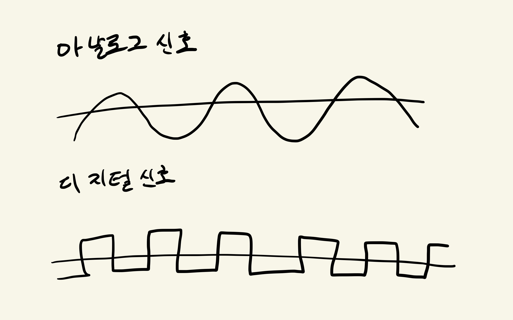

# 물리 계층
데이터를 전기 신호로 변환하기

0과 1로만 이루어진 비트열을 전기 신호로 변환하기 위해서는 OSI맨 아래의 물리 계층의 기술이 필요

## 전기 신호의 종류
- 아날로그 신호 : 물결모양, 전화/라디오
- 디지털 신호 : 막대모양

송신 측에서 보내는 데이터를 전기신호로 변환하여 수신측에 전달

## 랜카드 
비트열을 전기신호로 변환

> 물리계층은 컴퓨터와 네트워크 장비를 연결하고 컴퓨터와 네트워크 장비 간에 전송되는 데이터를 전기 신호로 변환하는 계층

