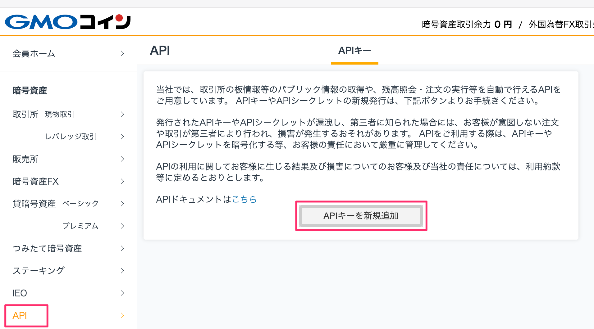
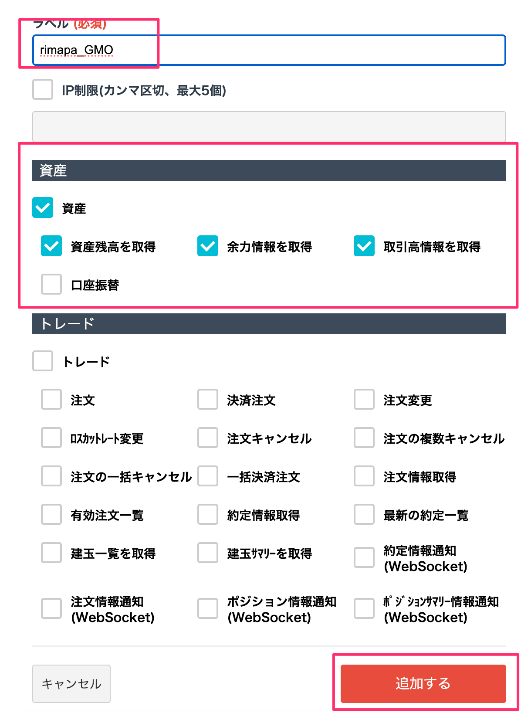
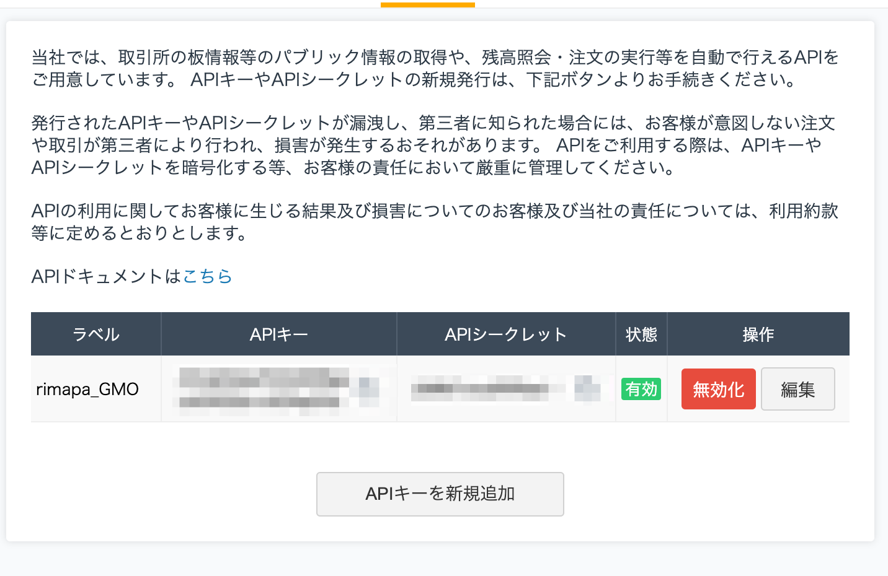

# Call GMO Coin API

GMO코인 API 이용해보았다.

> [GMO API 개요](https://api.coin.z.com/docs/#outline)

## API Key 작성

- GMO에 로그인
 [GMO Coin](https://coin.z.com/jp/member/home)

- API 탭에서 `APIキー新規追加`클릭

- 필요한 정보 입력후 `追加する`클릭

- 키 작성 확인후 키와 시크릿 백업

