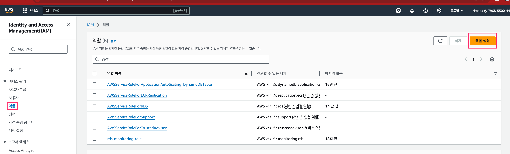

# Github actions에서 사용할 수 있는 AWS OIDC provider 구성


## AWS 접속 후 IAM 자격공급자 선택


## 공급자추가 클릭


## 공급자 추가를 위한 정보 입력


> 입력내용은 [github guide](https://docs.github.com/ko/actions/deployment/security-hardening-your-deployments/configuring-openid-connect-in-amazon-web-services) 참조

- OpenID Connect
- 공급자 URL : https://token.actions.githubusercontent.com
- 지문가져오기


- 대상 : sts.amazonaws.com


- 공급자추가 클릭


- 공급자가 추가된 것을 확인


## IAM ROLE 작성

- 역할 생성


- 웹 자격 증명 선택


- 다음 클릭

- 역할 정보 입력/ 역할 생성


- 생성된 역할 확인


- 깃에서 토큰 생성과 ecr접근을 위한 policy 설정


> `*`이용하여 전체 리포지토리 접근 가능
```
{
	"Version": "2012-10-17",
	"Statement": [
		{
			"Action": "ecr:GetAuthorizationToken",
			"Effect": "Allow",
			"Resource": "*"
		},
		{
			"Sid": "Statement1",
			"Effect": "Allow",
			"Action": [
				"ecr:PutImage",
				"ecr:UploadLayerPart",
				"ecr:InitiateLayerUpload",
				"ecr:CompleteLayerUpload",
				"ecr:BatchCheckLayerAvailability"
			],
			"Resource": "arn:aws:ecr:ap-northeast-1:{accountId}:repository/*"
		}
	]
}
```
- 폴리시 생성


- github actions에서 ecr 업로드 설정
```
name: ecr push image

on:
  push:

jobs:
  push:
    runs-on: ubuntu-latest
    # `permissions` を設定しないと OIDC が使えないので注意
    permissions:
      id-token: write
      contents: read
    steps:
      - uses: actions/checkout@v3

      # AWS 認証
      - uses: aws-actions/configure-aws-credentials@v1
        with:
          aws-region: "ap-northeast-1"
          role-to-assume: "arn:aws:iam::{accountId}:role/github-actionc-ecr-role"

      # ECR ログイン
      - uses: aws-actions/amazon-ecr-login@v1
        id: login-ecr # outputs で参照するために id を設定

      # Docker イメージを build・push する
      - name: build and push docker image to ecr
        env:
          # ECR レジストリを `aws-actions/amazon-ecr-login` アクションの `outputs.registry` から取得
          REGISTRY: ${{ steps.login-ecr.outputs.registry }}
          # イメージを push する ECR リポジトリ名
          REPOSITORY: "md-convertor-app"
          # 任意のイメージタグ
          # 今回は Git のコミットハッシュにしておく
          IMAGE_TAG: "latest"
        run: |
          cd src
          docker build . --tag ${{ env.REGISTRY }}/${{ env.REPOSITORY }}:${{ env.IMAGE_TAG }}
          docker push ${{ env.REGISTRY }}/${{ env.REPOSITORY }}:${{ env.IMAGE_TAG }}
```
| | |
| --- | --- |
|  | **POINT** <br> Line 20 : OIDC 프로바이더를 이용한 토큰 작성 및 git, ecr권한 부여된 역할 설정 <br> Line 30 ~ 35 : 로그인한 ECR, 설정한 repository tag로 이미지를 빌드 & 푸쉬 |

- 이미지 푸쉬 확인
