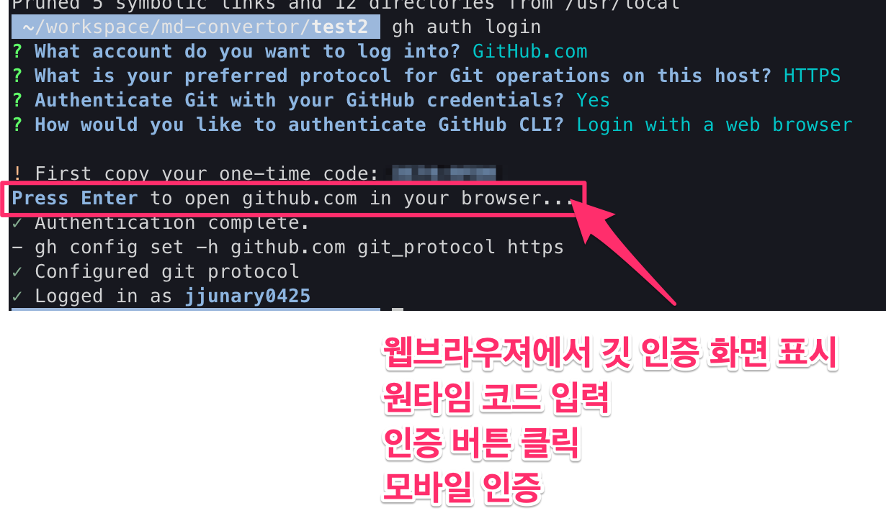

# Github Cli Setup with mac OS

[참조 페이지](https://zenn.dev/krabben16/articles/setup-github-cli-for-mac)

## install


``` sh
brew install gh
```

## 유저 인증

```
gh auth login
```

몇가지 질문에 대답한 후 웹에서 인증 완료




## 동작 확인 

```
gh repo list --json name,primaryLanguage,languages,owner,createdAt,updatedAt
```

## 커맨드 일람 문서

https://cli.github.com/manual/gh
