# 파파고 openapi 이용하기

영어 단어장을 정리할때 하나씩 한글로 타이핑하는것도 귀찮고 해서 번역 API를 돌려서 정리해보고자 한다.

## 네이버 개발자 등록 및 OpenAPI 이용 신청

[네이버 개발자 페이지](https://developers.naver.com/main/)


네이버 개발자 메인 페이지에서 papago를 선택
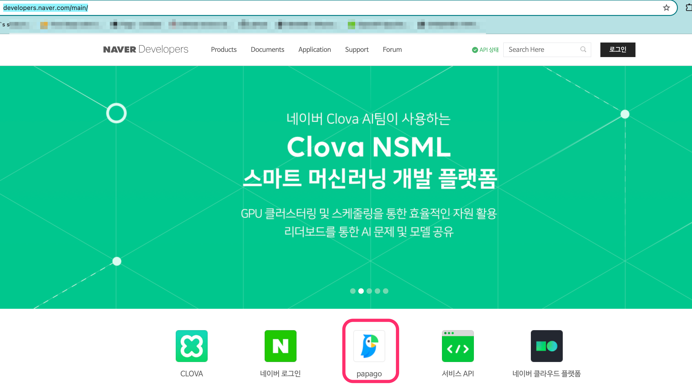

파파고 번역 페이지에서 `오픈 API이용 신청`을 선택
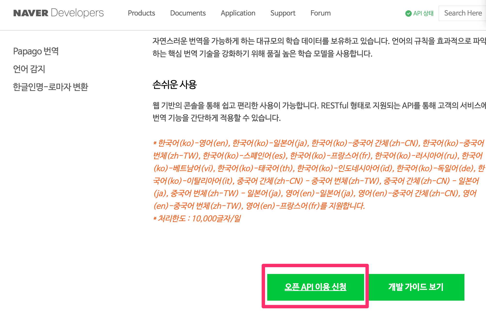

로그인 페이지가 나오면 로그인
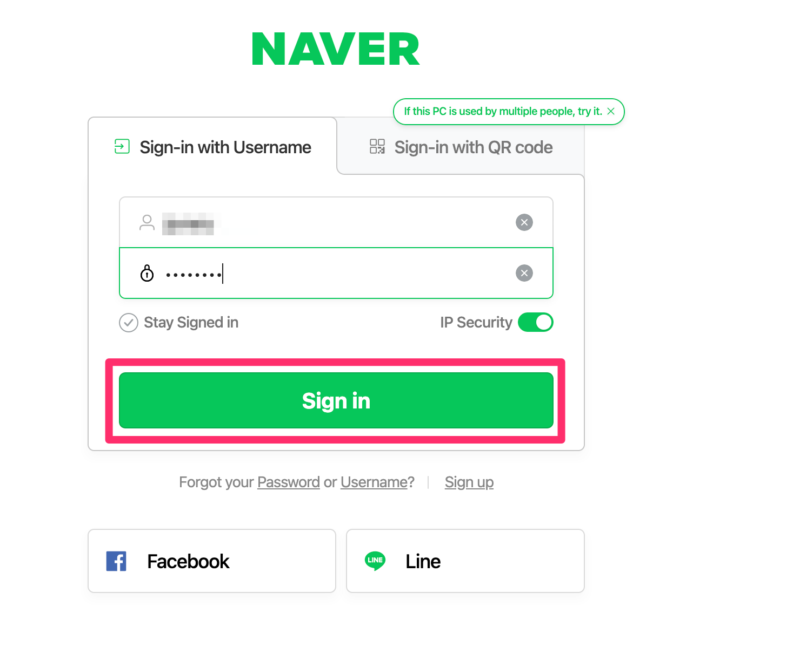

이용약관에 동의
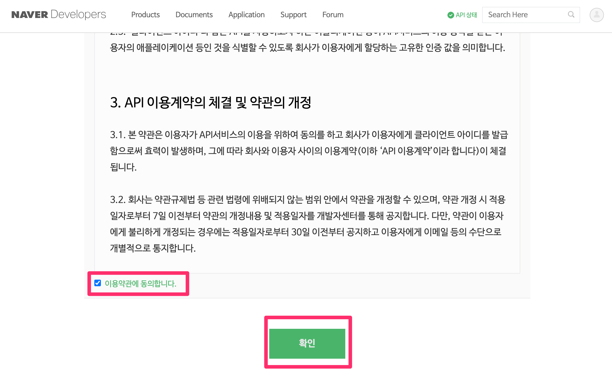

계정 정보 설정
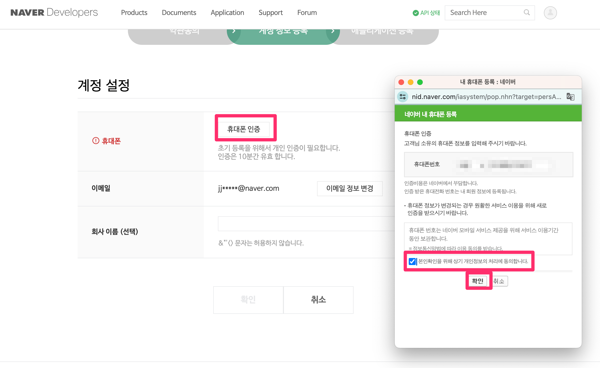

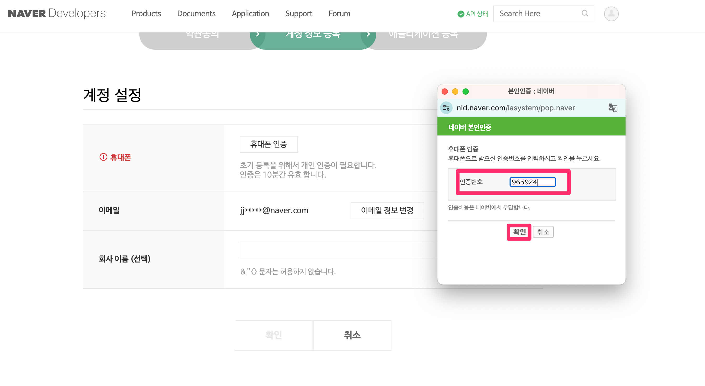

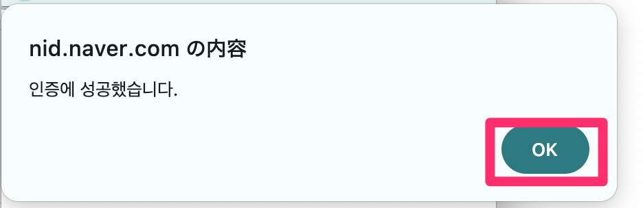

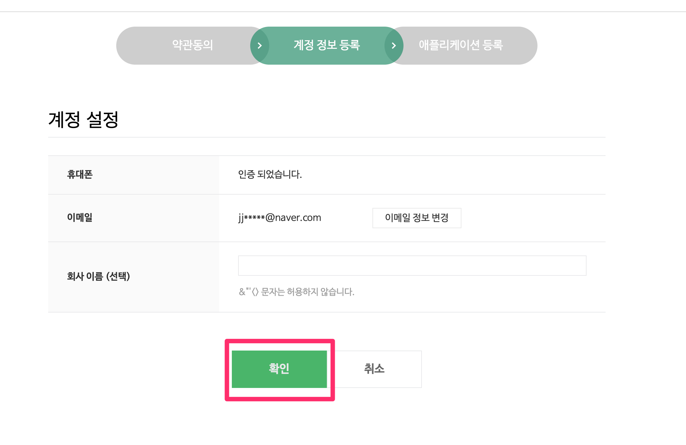

어플리케이션 정보 설정

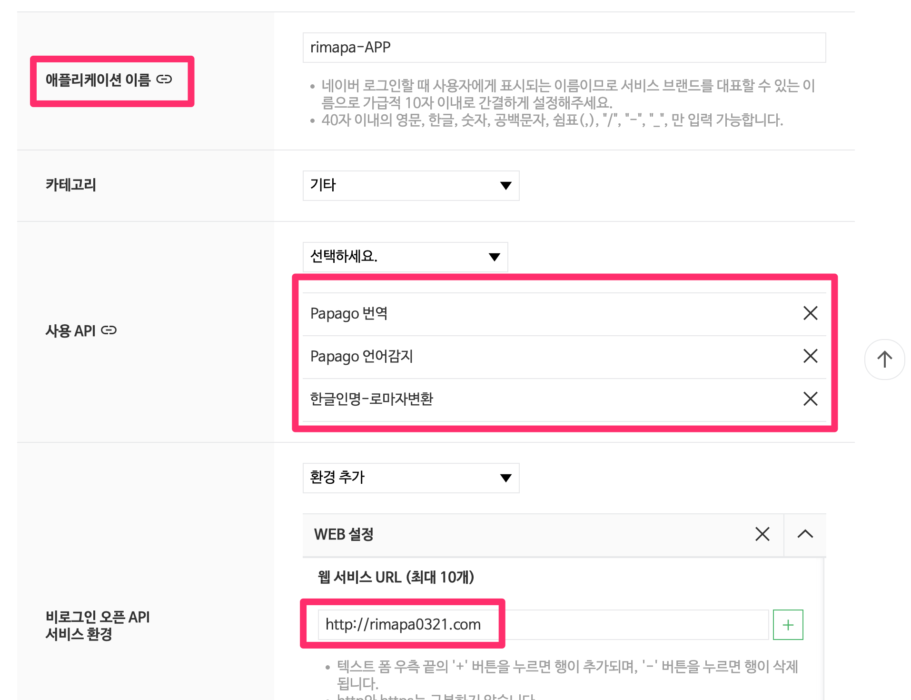

- 어플리케이션 이름 : 사용할 어플리케이션 이름 설정
- 사용 API : 번역관련 비로그인 오픈API사용
- WEB 설정 : rimapa0321 도메인 입력 

설정 완료
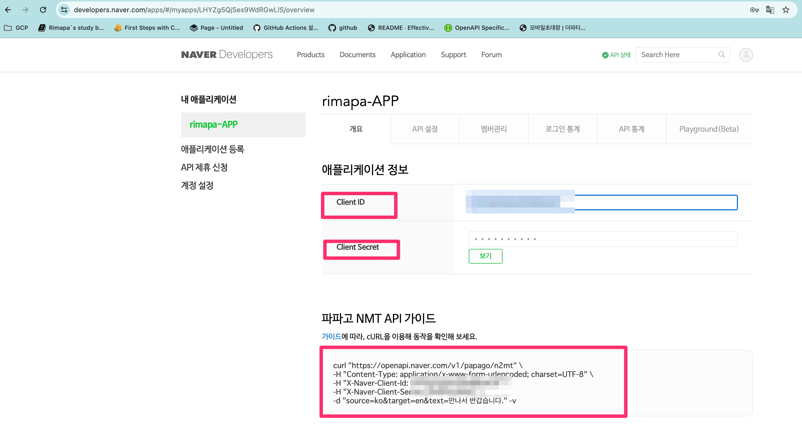

client ID와 secret은 별도 저장

cURL 확인

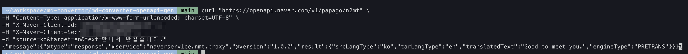

cURL 성공적으로 레스폰스 수신

cURL을 POSTMAN으로 변경

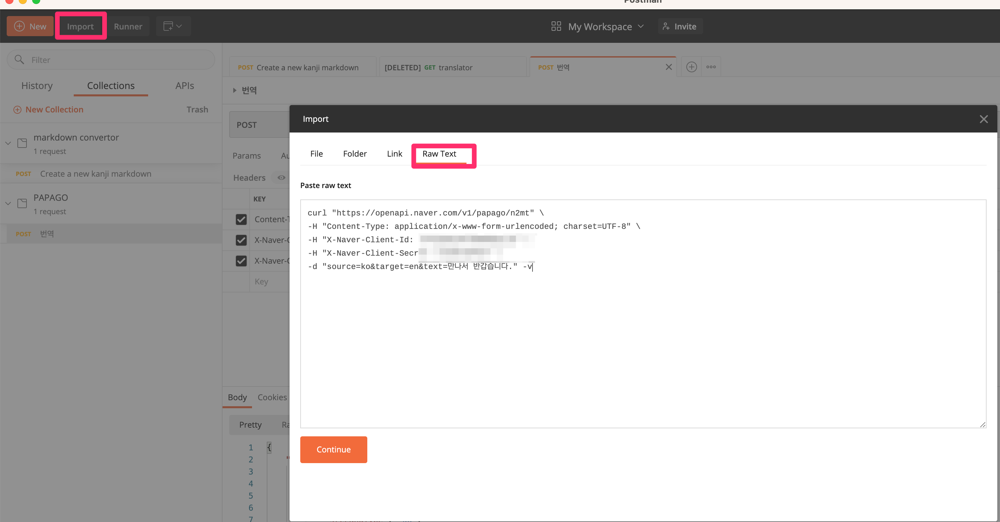

POSTMAN 결과 확인

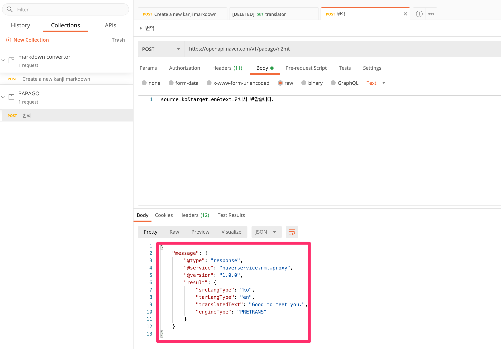


Body를 json으로 변환해도 문제없이 성공
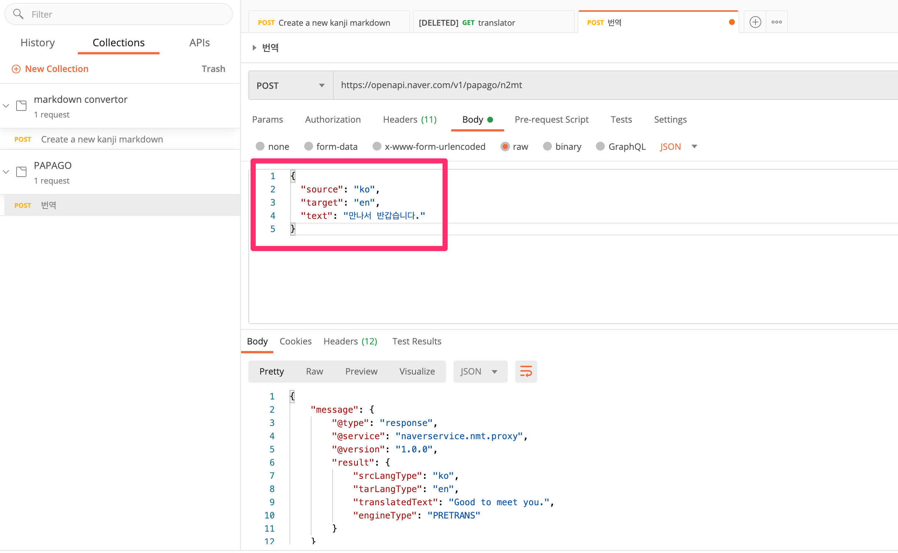

> **Warning**

 Header의 컨텐츠 타입 변경할것

```
Content-Type:application/json; charset=UTF-8
```
