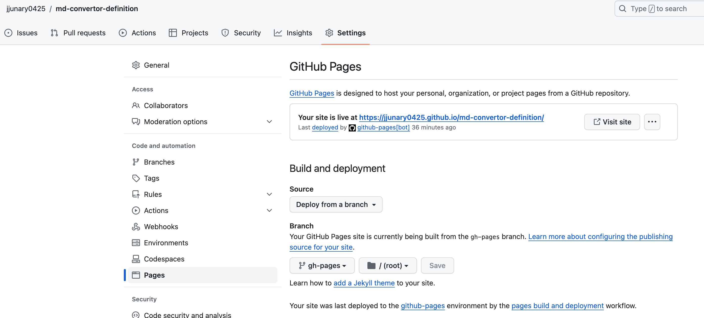

# OpenAPI `swagger` 파일을 Object별로 분할하여 관리하기

Restful 서비스를 만들기 위해 가장 먼저 definition 작업을 실시하는데 <br>OepnAPI로 만든 yaml파일은 내용이 길어져 가독성이 매우 떨어진다.
<br>이러한 이유로 예전 부터 해보고 싶었던 파일을 분할하여 작업을 실행 해 보았다.

## 폴더 구성은 OpenAPI의 각 schema object단위로 구성

[OpenAPIObject](https://swagger.io/specification/#schema)

우선 가장 많이 사용하는 path와 compenent만 나누어 보았다.
<br>추후 다른 스키마 오브젝트에 대해서도 분할 작업을 해 볼까 한다.

```
.
└── openapi
    ├── components
    │   ├── examples
    │   └── schemas
    └── paths
```

folder 구성용 커맨드
```
mkdir -p openapi/components/examples
mkdir -p openapi/components/schemas
mkdir -p openapi/paths
touch openapi/openapi.yaml

```

```
mkdir -p .github/workflows
touch .github/workflows/update-git-pages.yml
```
openapi 공식 사이트의 문법을 참조
[OpenAPI Guide](https://swagger.io/docs/specification/about/)

## openapi.yaml
메인 뼈대파일

openapi 폴더에 작성

``` yaml
openapi: "3.0.3"
info:
  version: 2024.1.5
  title: markdown convertor
  description: Restful API for markdown convertor
servers:
  - url: http://localhost:8080/api
    description: markdown convertor Service
tags:
  - name: kanji
  description: Making Study File for Kanji
paths:
  /kanji:
    $ref: "./paths/kanji.yaml#/kanji"
components:
  schemas:
    kanji:
      $ref: "./components/schemas/kanji.yaml#/kanji"
    kanjiSummary:
      $ref: "./components/schemas/kanji.yaml#/kanjiSummary"
    usage:
      $ref: "./components/schemas/usage.yaml"
    markdownResult :
      $ref: "./components/schemas/markdownResult.yaml"
    
```

## schemas
model에 해당하는 데이터를 관리

kanji.yaml

object 명으로 시작하는 경우 `#/object`명으로 참조 가능하기 때문에 하나의 파일에 복수 오브젝트를 기재하여도 다른 곳에서 참조 가능
``` yaml
kanjiSummary:
  type: object
  required:
  - kanji
  properties:
    kanji:
      $ref: '#/kanji'
    description:
      type: string
    usage:
      $ref: '../schemas/usage.yaml' 
kanji:
  type: object
  required:
  - character
  properties:
    character:
      type: string
    yomi:
      type: string
    hun:
      type: string
```

## path

method에 해당하는 데이터를 관리

kanji.yaml
``` yaml
kanji :
  post :
    summary :  "Create a new kanji markdown"
    operationId :  "postKanjiMarkdown"
    requestBody :
      description: Optional description in *Markdown*
      required: true
      content:
        application/json:
          schema:
           $ref: '../components/schemas/kanji.yaml#/kanjiSummary'
          examples:
            kanjiSummary:
              $ref: '../components/examples/kanji.yaml'
    responses :
      '200' :
        description :  "OK"
        content :
          text/plain :
            schema :
              type :  string
              example :  "## 漢字\n\n### かん\n\n#### 한자\n\n한자는 중국에서 유래한 문자이다.\n\n|漢字|ふりがな|뜻|\n|---|---|---|\n|漢字1|かんじ1|한자1|\n|漢字2|かんじ2|한자2|\n\n"
            
    
```

examples를 사용할때에는 examples -> object -> value 순으로 작성

``` yaml
paths:
  /users:
    post:
      summary: Adds a new user
      requestBody:
        content:
          application/json:     # Media type
            schema:             # Request body contents
              $ref: '#/components/schemas/User'   # Reference to an object
            examples:    # Child of media type
              Jessica:   # Example 1
                value:
                  id: 10
                  name: Jessica Smith
              Ron:       # Example 2
                value:
                  id: 11
                  name: Ron Stewart
      responses:
        '200':
          description: OK
```

components/example/kanji.yaml
``` yaml
value:
  character: 漢
  yomi: かんじ
  hun: 한자
  description :  한자는 중국에서 유래한 문자이다.
  usage : 
    header : 漢字,ふりがな,뜻
    contents : ["漢字1,かんじ1,한자1", "漢字2,かんじ2,한자2"]
```

## docker compose로 swagger-ui 확인
다음 컴포즈 구성으로 실행 후 확인

docker-compose.yaml
``` yaml
version: '3.9'

services:
  swagger-ui:
    image: swaggerapi/swagger-ui
    container_name: "swagger-ui"
    ports:
      - "8002:8080"
    volumes:
      - ./openapi:/openapi/
    environment:
      SWAGGER_JSON: /openapi/openapi.yaml
```

실행
```
docker-compose up
```

확인 <br>
http://localhost:8002/ 

## swagger-ui 확인 후 git hub action이용하여 redocly html publish

update-git-pages.yml
``` yml
# This is a basic workflow to help you get started with Actions

name: update-git-pages

# Controls when the workflow will run
on:
  # Triggers the workflow on push or pull request events but only for the "main" branch
  push:
    branches: [ "main" ]

  # Allows you to run this workflow manually from the Actions tab
  workflow_dispatch:

# A workflow run is made up of one or more jobs that can run sequentially or in parallel
jobs:
  # This workflow contains a single job called "build"
  build:
    # The type of runner that the job will run on
    runs-on: ubuntu-latest

    # Steps represent a sequence of tasks that will be executed as part of the job
    steps:
      - uses: actions/checkout@v3

      # node install
      - uses: actions/checkout@v4
      - uses: actions/setup-node@v4
        with:
          node-version: 18
          
      - name: install cli
        run: npm install -g redoc-cli
      
      - name: make docs folder
        run: mkdir docs

      - name: bundle
        run: redoc-cli bundle ./openapi/openapi.yaml -o ./docs/index.html

      - name: Deploy
        uses: peaceiris/actions-gh-pages@v3
        with:
          github_token: ${{ secrets.GITHUB_TOKEN }}
          publish_dir: ./docs
```

git hub page의 구성은 gh-pages 브런치에서 디플로이하도록 세팀

